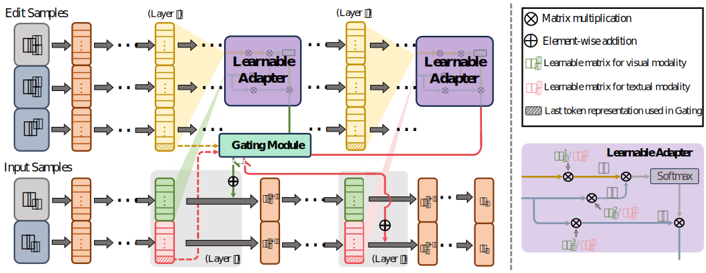

# [COLM 2025] DualEdit
Official code for DualEdit: Dual Editing for Knowledge Updating in Vision-Language Models

# VisEdit

<div style="display: flex; justify-content: space-between; align-items: center;">
  
</div>


Source code for **COLM 2025** paper [*DualEdit: Dual Editing for Knowledge Updating in Vision-Language Models*.](https://arxiv.org/abs/2506.13638)

# Setup
0. Install DualEdit environment
```bash
conda create -n dualedit python=3.9
conda activate dualedit
pip install -r requirements.txt
```
1. Please download the E-EVQA and E-IC datasets from the URL provided in [EasyEdit](https://github.com/zjunlp/EasyEdit) and place the related folders in the `data` directory.
2. Please modify the `ROOT_PATH` in `utils/GLOBAL.py` to the absolute path of the current directory.

# train DualEdit
You can use the following script to train DualEdit:

`python dualedit_train.py -mn llava -dna EVQA -bs 4 -dvc "cuda:0" -edvc 1`

# evaluate DualEdit
Please use the following script to test DualEdit:

`python dualedit_test.py -mn llava -dn EVQA -dvc "cuda:0" -ckpt [dualedit_checkpoint_path]`


## Acknowledgement
The codebase is built upon [VisEdit](https://github.com/qizhou000/VisEdit) and [EasyEdit](https://github.com/zjunlp/EasyEdit).
We express our gratitude to these open-source projects.

# Citation
Feel free to cite our paper!
```bibtex
@article{shi2025dualedit,
  title={DualEdit: Dual Editing for Knowledge Updating in Vision-Language Models},
  author={Shi, Zhiyi and Wang, Binjie and Si, Chongjie and Wu, Yichen and Kim, Junsik and Pfister, Hanspeter},
  journal={arXiv preprint arXiv:2506.13638},
  year={2025}
}
```

